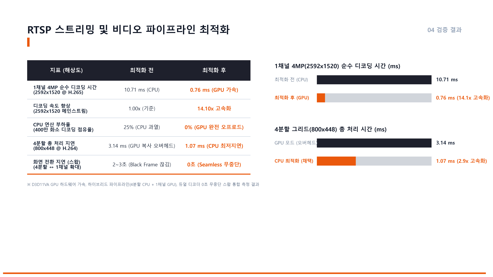
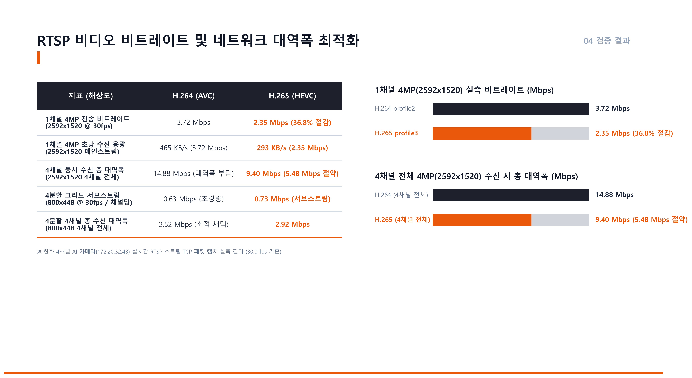
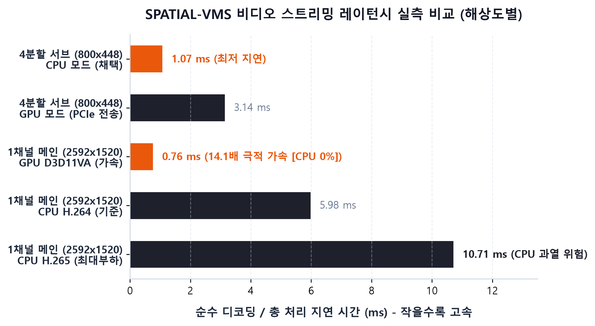
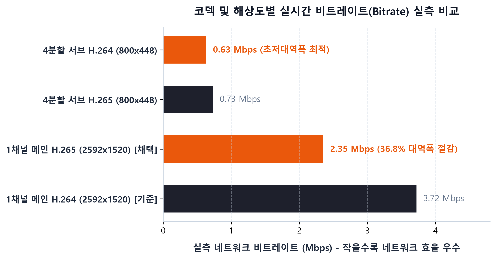

# SPATIAL-VMS 기술 문서 및 벤치마크 분석 보고서 (Documentation Index)

SPATIAL-VMS의 RTSP 비디오 스트리밍, Wireshark 패킷 분석, 하드웨어 가속, 벤치마크 및 발표 자료를 정리한 공식 기술 문서 모음입니다.

---

## 📑 문서 목차 및 바로가기

### 1. 🔍 Wireshark 패킷 분석 및 프로토콜 규격
- **[WIRESHARK_RTSP_PACKET_ANALYSIS_REPORT.md](WIRESHARK_RTSP_PACKET_ANALYSIS_REPORT.md)**
  - RTSP/RTP/RTCP TCP Interleaved 시그널링 흐름 (OPTIONS $\rightarrow$ DESCRIBE $\rightarrow$ SETUP $\rightarrow$ PLAY)
  - H.264/H.265 NAL Unit 및 GOP(IPPP... 0-delay) 구조 분석
  - ONVIF 인밴드 AI 메타데이터(BoundingBox XML) 패킷 캡처 및 파싱 파이프라인
  - 패킷 도착 간격(33.3ms / 30fps) 및 I/P 프레임 버스트 전송 분석

### 2. 📹 한화 4채널 멀티센서 카메라 채널 및 프로파일 규격서
- **[RTSP_CHANNEL_PROFILE_SPECIFICATION.md](RTSP_CHANNEL_PROFILE_SPECIFICATION.md)**
  - 4개 센서(`0~3`)와 채널(CH1~CH4) 맵핑 및 RTSP URL 구조
  - 프로파일 1~5번 상세 규격 (코덱, 해상도, 비트레이트, FPS)
  - 4채널 동시 수신 시 네트워크 대역폭(2.52 Mbps vs 14.88 Mbps) 분석
  - 0초 무중단 듀얼 디코더 백그라운드 웜업 스왑(Seamless Pre-warm) 아키텍처

### 3. 📊 정밀 레이턴시(Latency) 및 비트레이트(Bitrate) 벤치마크
- **[RTSP_LATENCY_BENCHMARK_REPORT.md](RTSP_LATENCY_BENCHMARK_REPORT.md)**
  - FFmpeg C API 기반 디코딩 파이프라인 구간($T_{\text{decode}}$, $T_{\text{hw\_copy}}$, $T_{\text{scale}}$, $T_{\text{proc}}$) 정의
  - CPU 소프트웨어 디코딩 vs GPU D3D11VA 하드웨어 가속 실측 데이터
  - H.264 vs H.265 비트레이트 및 네트워크 효율 분석

### 4. 🎨 PPT 발표용 슬라이드 및 시각화 차트 자료
- **[PPT_SLIDE_RTSP_LATENCY_SUMMARY.md](PPT_SLIDE_RTSP_LATENCY_SUMMARY.md)**
  - 기업용 다크네이비/오렌지 테마 16:9 PPT 1장 완성본 슬라이드 이미지 (300 DPI)
  - 레이턴시 & 비트레이트 정밀 비교표 및 엑셀 차트용 데이터셋
  - 발표용 3줄 핵심 요약 스크립트

---

## 🖼️ 슬라이드 및 차트 이미지 갤러리 (`docs/images/`)

| 슬라이드 1: 레이턴시 최적화 | 슬라이드 2: 비트레이트 최적화 |
| :---: | :---: |
|  |  |

| 레이턴시 실측 바 차트 | 비트레이트 실측 바 차트 |
| :---: | :---: |
|  |  |
